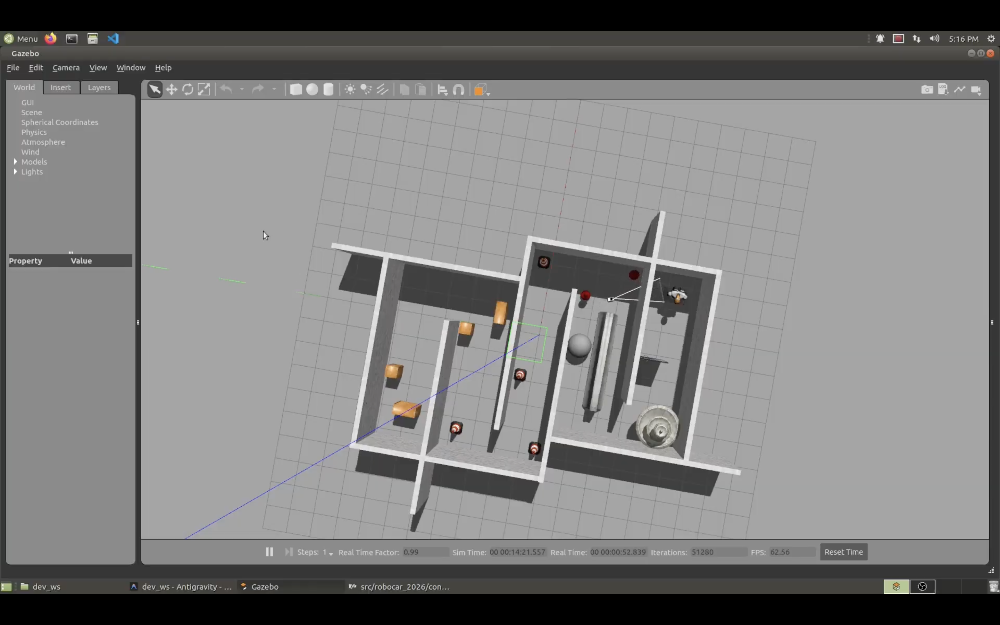

# Rosbot - Autonomous Robot Simulation



Welcome to the **Rosbot** project! This README provides an overview of the project, setup instructions, and other relevant details.

## Table of Contents

- [Visit](#visit)
- [About](#about)
- [Features](#features)
- [Installation](#installation)
- [Structure](#structure)
- [Contributors](#contributors)
- [Contributing](#contributing)
- [License](#license)

## Visit

- [Repository](https://github.com/aabubokarr/rosbot.git)

## About

**Rosbot** is a ROS 2 and Gazebo-based autonomous mobile robot simulation. It models a differential-drive robot equipped with Lidar and camera sensors, designed for mapping, localization, and autonomous navigation within simulated Gazebo worlds using SLAM and Nav2.

## Features

- Gazebo Simulation
- ROS 2 Control & Gazebo Plugins
- Sensor Integration
- SLAM (Simultaneous Localization & Mapping)
- Autonomous Navigation
- Multiplexed Velocity Commands

## Installation

1. Clone the repository:
   ```bash
   git clone https://github.com/aabubokarr/rosbot.git
   ```
2. Navigate to the project directory and follow commands.txt file:
   ```bash
   cd rosbot
   ```

## Structure

```
rosbot/
├── config/                  # RViz and ROS 2 parameter configuration files
│   ├── drive_bot.rviz
│   ├── gazebo_params.yaml
│   ├── joystick.yaml
│   ├── main.rviz
│   ├── mapper_params_online_async.yaml
│   ├── my_controllers.yaml
│   ├── nav2_params.yaml
│   └── twist_mux.yaml
├── description/             # URDF and Xacro files defining the robot structure
│   ├── camera.xacro
│   ├── gazebo_control.xacro
│   ├── inertial_macros.xacro
│   ├── lidar.xacro
│   ├── robot.urdf.xacro
│   ├── robot_core.xacro
│   └── ros2_control.xacro
├── launch/                  # ROS 2 Python launch scripts
│   ├── joystick.launch.py
│   ├── launch_sim.launch.py
│   ├── localization_launch.py
│   ├── navigation_launch.py
│   ├── online_async_launch.py
│   └── rsp.launch.py
├── worlds/                  # Gazebo simulation world files
│   ├── empty.world
│   ├── obstacles.world
│   └── room.world
├── CMakeLists.txt           # Build configuration file
├── LICENSE                  # License file
├── package.xml              # ROS 2 package manifest
├── README.md                # Project documentation
├── commands.txt             # Command guide for running simulations
├── rosbot.png               # Main project illustration
└── diagram.png              # Project diagram
```

## Contributors

<p align="center">
  <a href="https://github.com/aabubokarr/rosbot/graphs/contributors">
    
  </a>
</p>

## Contributing

Contributions are welcome! Please follow these steps:

1. Fork the repository.
2. Create a new branch:
   ```bash
   git checkout -b feature-name
   ```
3. Commit your changes:
   ```bash
   git commit -m "Add feature-name"
   ```
4. Push to the branch:
   ```bash
   git push origin feature-name
   ```
5. Open a pull request.

## License

This project is licensed under the [MIT License](LICENSE).
